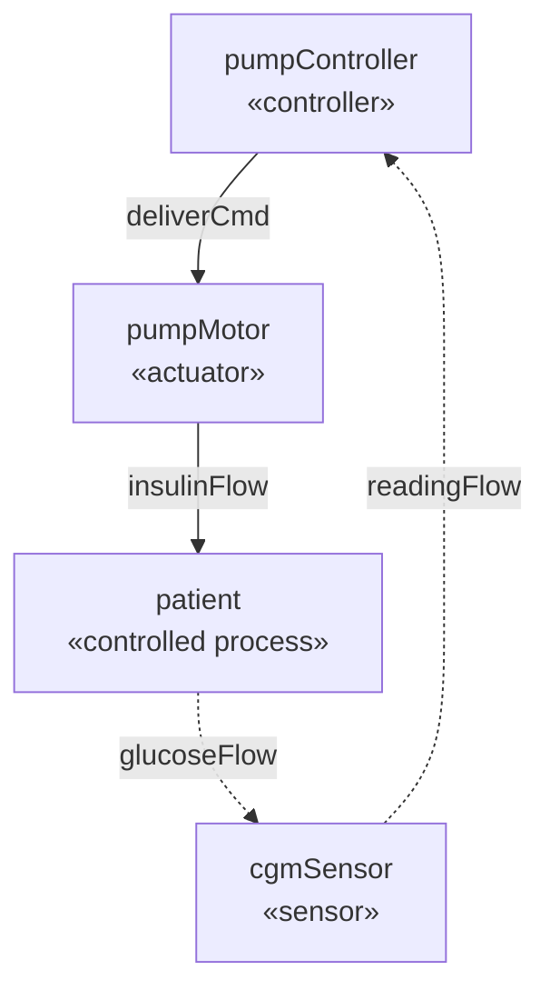

# sysml-lean

A formalization of (a growing subset of) [SysML v2](https://www.omg.org/spec/SysML/2.0/)
in Lean 4, aimed at machine-checked [STPA / STPA-Sec](https://psas.scripts.mit.edu/home/get_file.php?name=STPA_handbook.pdf)
analyses of system models.

## Architecture

Two layers over a shared core, with STPA on top:

- **`Sysml.Core`** — shared vocabulary (names, feature directions).
- **`Sysml.Kernel`** (deep layer) — the SysML v2 *abstract syntax* (spec §8.3)
  embedded as a graph of elements and relationships, mirroring how the spec
  itself presents the language (§7.2). `Sysml.Kernel.WellFormed` gives
  `Bool`-valued (hence decidable) well-formedness rules drawn from the
  constraints of §7.5 (namespaces), §7.6 (definition/usage duality), and
  §7.13 (connections), so concrete models are certified by `decide`.
- **`Sysml.Dsl`** — SysML v2 *textual notation* (§8.2.2) embedded in Lean via
  a custom syntax category: the `sysml name { … }` command parses (a subset
  of) real SysML surface syntax with Lean's own parser and elaborates it into
  a deep `Model`; `#sysml name` goes the other way, delaborating a `Model`
  back to textual notation (`Sysml.Kernel.Render`). Ids are assigned during
  elaboration — recover them by name with `Model.idOf`.
- **`Sysml.Viz`** — editor-independent diagrams: pure `toDot`/`toMermaid`
  emitters for the part-connection graph and the STPA control structure
  (control solid-down, feedback dashed-up), plus elaboration-time commands
  `#sysml_dot`/`#sysml_mermaid`/`#stpa_dot`/`#stpa_mermaid` (print) and
  `#sysml_svg`/`#stpa_svg` (shell out to graphviz `dot`, write an SVG).
  Mermaid output pastes straight into GitHub markdown.
- **`Sysml.View`** — curated typed projections: recovers the part-level
  connection graph (who talks to whom) from the port-level model.
- **`Sysml.Stpa`** — STPA over the view: control structures with roles
  (controller / actuator / sensor / controlled process), the authority
  relation (must be a DAG) kept separate from information flow (may loop),
  closed-control-loop checking via reachability, and the full artifact
  chain — losses, hazards (tagged `safety`/`security`, so STPA-Sec drops
  in), system constraints, the four UCA kinds, controller requirements,
  loss scenarios — with traceability, coverage, and *totality* checks
  (every hazard constrained; every UCA refined by a requirement).
- **`Sysml.Typing`** — the type-system view (see
  `docs/stpa-typesystem.pdf`): the document checks restated as Prop-level
  typing judgments (`WellTyped`), with reflection theorems proving the
  executable checker decides them exactly — an *orphaned UCA* (no derived
  requirement) is precisely a non-exhaustiveness error, and `by decide`
  certifies concrete documents against the judgments.
- **`Sysml.Findings`** — structured diagnostics: where the judgments say
  *whether*, `Analysis.findings` says *what and where* — `{check, severity,
  subject, message}` records for orphaned UCAs, unconstrained hazards,
  coverage gaps, broken traces, open loops, and authority cycles.
  `(check, subject)` is the stable identity used to diff findings across
  revisions.
- **`Sysml.Report`** — the analysis as a markdown report: the full artifact
  chain as tables with traceability columns, plus verification status lines.
- **`Sysml.Gsn`** — the artifact chain as a Goal Structuring Notation
  assurance-case skeleton (DOT/SVG): root → losses → hazards →
  constraints/UCA-negations → requirements, scenarios as context, the Lean
  certificate as top-level context. Requirement leaves render *undeveloped*
  (the certificate evidences the argument's structure, not requirement
  satisfaction).
- **`Sysml.Oracle`** — round-trip validation of the emitter against an
  independent second-source SysML v2 parser (see below).

## Worked example

`Examples.InsulinPump` models a closed-loop insulin pump — written in
SysML v2 textual notation via the `sysml` command:

```
sysml pumpModel {
  package InsulinPumpSystem {
    part def Controller;
    item def InsulinCommand;
    part pumpController : Controller {
      out port cmdOut;
      in port readingIn;
    }
    -- …
    flow deliverCmd of InsulinCommand from pumpController.cmdOut to pumpMotor.cmdIn;
  }
}
```

and proves, by computation:

- `pumpModel_wellFormed` — the model satisfies the SysML well-formedness rules;
- `pumpCs_wellFormed` — the control structure is role-correct and every
  control loop is closed (the controller gets feedback from every process
  it controls);
- `analysis_wellFormed` — the whole analysis checks out: every artifact in
  the chain (losses, hazards, system constraints, UCAs, controller
  requirements, scenarios) is traceable, all four UCA kinds are covered (or
  justified not-applicable) for every control path, every hazard is
  addressed by a constraint, and every UCA is refined by a requirement;
- `analysis_wellTyped : WellTyped analysis` — the same, certified by
  `decide` directly against the Prop-level typing judgments via the
  reflection theorem.

The control structure, as emitted by `#stpa_mermaid pumpCs pumpModel`:



## Layout

- `Sysml` — the library (kernel, DSL, view, STPA, typing, findings, report,
  GSN, viz, oracle).
- `Examples` — worked models (`Examples/*.lean`) plus a registry
  (`Examples.lean`) the CLI renders from. Certificates live here as theorems.
- `Cli.lean` — the `sysml` executable.
- `Tests.lean` — the `lake test` driver: negative tests (broken models and
  documents must be *rejected*, guarding against vacuous checks), renderer
  smoke tests, findings-engine checks, and the oracle round-trip.
- `docs/*.agents.md` — working notes: `plan.agents.md` (execution plan),
  `ci-product.agents.md` (CI product), `paper.agents.md` (paper track).

## Building & CLI

```sh
lake build
lake test
lake exe sysml list
lake exe sysml check --json                                 # findings as JSON
lake exe sysml diff old.json new.json --markdown            # findings diff (CI/PR bot)
lake exe sysml render insulin-pump                          # SysML textual notation
lake exe sysml render insulin-pump --format report          # markdown STPA report
lake exe sysml render insulin-pump --format mermaid --stpa  # control structure
lake exe sysml render insulin-pump --format svg --stpa -o cs.svg
lake exe sysml render insulin-pump --format gsn-svg -o gsn.svg  # assurance case
lake exe sysml validate                                     # oracle round-trip
```

## CI: safety analysis as code

The GitHub Actions workflow builds, runs the full test suite (fetching the
oracle jar checksum-pinned; skipping the round-trip gracefully if the fetch
fails), and uploads verdicts (`check --json`), markdown reports, and
control-structure/GSN SVGs as build artifacts. On pull requests, a
`findings-diff` job computes verdicts at the base and head revisions, diffs
them (`sysml diff --markdown`), posts a sticky PR comment, and fails when
error findings are introduced — an analysis regression (say, a newly
orphaned UCA) fails CI the way a type error does.

## Emitter validation (second-source oracle)

`sysml validate` round-trips the textual-notation emitter through the
[MontiCore SysML v2 parser](https://github.com/MontiCore/sysmlv2) — an
independent second-source parser built for comparison with the OMG pilot
implementation. Download
[`MCSysMLv2.jar`](https://www.monticore.de/download/MCSysMLv2.jar) to
`vendor/MCSysMLv2.jar` (or set `MCSYSML_JAR`, or pass `--jar`); a JRE ≥ 21
is required. `lake test` runs the same round-trip automatically when the
jar is present and skips it (staying green) when it isn't.

Two tool quirks are handled in `Sysml.Oracle`: the jar exits 0 even on
parse errors (errors are `[ERROR]` lines on stdout, which we grep), and its
semantic checks are incomplete (fine — semantics on our side are covered by
the `decide` certificates).

Std-only: no dependencies beyond the Lean toolchain (`lean-toolchain`).
(The community `lean4-cli` package was considered for the CLI, but its root
module is named `Cli`, colliding with `Cli.lean`; the argument surface is
small enough to hand-roll.)

## Roadmap

See `docs/plan.agents.md` for the live plan. Headlines: an LLM-in-the-loop
prototype guarded by the type system; loss scenarios with causal-factor
structure (STPA step 4 proper, promoting `scenariosCover` into
`wellFormed`); formal UCA contexts over typed process-model variables
(completeness as case exhaustiveness); a `.sysml` file parser for real
models; richer STPA-Sec vocabulary (adversary models, disruption
scenarios); behavioral (LTS) semantics linking document typing to model
reachability.

The spec PDF lives in `docs/sysml2-spec.pdf` (600+ pages — grep the extracted
text rather than loading it wholesale).
